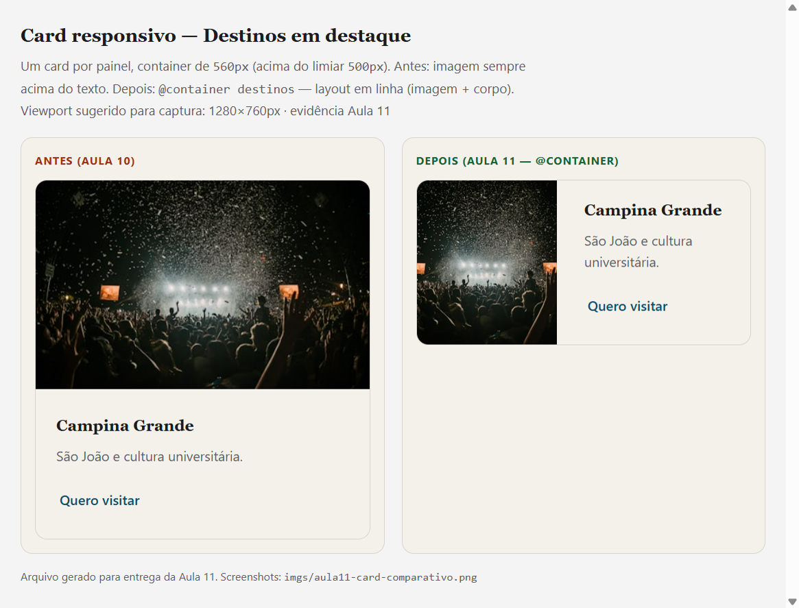

### Aplicações para Internet — Aula 11
### Responsive Challenge: auditoria, @layer e container queries

Esta entrega corresponde à **Aula 11**, com foco em **auditoria de responsividade**, **CSS Cascade Layers** (`@layer`), **Container Queries** (`@container`) e **restrições de mercado** (projetor e navegação por teclado). O projeto **mantém** as bases das **Aulas 08–10** (layout responsivo, JS, tokens ITCSS e bundle).

### Aplicações para Internet — Aula 10 (referência)
### ITCSS + design tokens e CSS em produção (bundle)

Esta entrega corresponde à **Aula 10**, com foco em **tokens de design**, **organização em camadas ITCSS** (arquivos modulares em `css/`) e **uma única folha de estilo em produção** (`css/site.bundle.css`, gerada por `scripts/build-css.ps1`). O projeto **mantém** o que foi consolidado na **Aula 08** (layout responsivo com Flexbox, Grid e media queries) e na **Aula 09** (**JavaScript** em `js/main.js`, **acessibilidade** com teclado e ARIA, componentes interativos e **feedback visual** no cabeçalho ao rolar a página).

- ### Brief do projeto (requisitos)
- **1) Contexto (2–3 frases)**: Projeto de **landing page** em **HTML/CSS** para praticar **layout responsivo**. O foco é reorganizar o conteúdo com **Flexbox/Grid** e **media queries** em três breakpoints.
- **2) Público-alvo**: Pessoas **16–35 anos**, acessando em contexto de uso rápido no dia a dia. **Dispositivo principal**: **smartphone**.
- **3) Dor principal**: O usuário não consegue **ler e navegar bem em diferentes telas** quando o layout não é responsivo (quebras/overflow/zoom).
- **4) Critério de sucesso**: **O usuário consegue** usar o site em **375px, 768px e 1024px** sem scroll horizontal, com texto/imagens legíveis e navegação clara.

- **Stack**: HTML5 / CSS3 / JavaScript (Vanilla)  
- **CSS em produção**: um único arquivo `css/site.bundle.css`, gerado pelo script `scripts/build-css.ps1` (ordem ITCSS). Em desenvolvimento, é possível apontar o `<link>` para `css/main.css` (cadeia de `@import`).
- **Carga horária**: 2 horas  
- **Professor**: Jeofton Costa  

### Conteúdo desta aula (Aula 11 — foco atual)
- **Fase 1 — Auditoria:** checklist técnico de 12 itens com status OK/Falha e backlog (problema, causa, correção) em [`docs/aula11-responsive-audit.md`](docs/aula11-responsive-audit.md)
- **Fase 2 — @layer (Caminho A):** `tokens → reset → base → layout → components → overrides` em `css/main.css` e em `css/site.bundle.css`; remoção de `!important` desnecessários (nav CTA, abas)
- **Fase 2 — Container Queries (Caminho B):** `.cards-grid` (`container-name: destinos`) e `.gastro-grid` (`gastro`) — o card adapta `flex-direction` pelo espaço do pai, não só pela viewport
- **Fase 2 — Itens críticos (Caminho C):** `overflow-x: clip`, área de toque 44px, inputs com `font-size` mínimo 16px, `.split` mobile-first, hovers em `@media (hover: hover)`
- **Fase 3 — Carta do cliente:** legibilidade em projetor (≥1600px + `clamp` em `html`); navegação por Tab com `:focus-visible` e classe `.using-keyboard` em `js/main.js`
- **Evidência comparativa:** screenshot antes/depois do card em [`imgs/aula11-card-comparativo.png`](imgs/aula11-card-comparativo.png); página auxiliar [`docs/comparativo-card-aula11.html`](docs/comparativo-card-aula11.html)

### Alterações realizadas nesta versão (Aula 11)

| Área | Arquivo(s) | O que mudou |
|------|------------|-------------|
| Cascade Layers | `css/main.css`, `scripts/build-css.ps1`, `css/site.bundle.css` | Declaração `@layer` e agrupamento dos módulos ITCSS por camada |
| Overrides globais | `css/overrides.css` | Foco visível, toque mínimo, inputs iOS, projetor, `max-width` em telas largas |
| Container queries | `css/layout.css`, `css/components/card.css`, `css/components/gastro.css` | `container-type` nos grids; `@container` para layout horizontal do card |
| Layout mobile | `css/layout.css` | `.split` passa a 1 coluna no mobile e 2 colunas a partir de 769px |
| Tipografia fluida | `css/tokens/typography.css` | `html { font-size: clamp(16px, 1.1vw, 20px) }` |
| Hover em touch | `css/components/card.css`, `css/components/gastro.css` | Efeitos de hover apenas com `@media (hover: hover)` |
| Nav sem `!important` | `css/components/nav.css` | Estilos do CTA delegados à camada `overrides` |
| Teclado | `js/main.js` | Listeners `Tab` / `mousedown` para `.using-keyboard` |
| Documentação | `docs/aula11-responsive-audit.md`, `docs/comparativo-card-aula11.html` | Checklist, backlog e captura comparativa |

**Arquivos novos:** `css/overrides.css`, `docs/aula11-responsive-audit.md`, `docs/comparativo-card-aula11.html`, `imgs/aula11-card-comparativo.png`

#### Como validar (Aula 11)

1. Abra `index.html` no Live Server e use **Ctrl+Shift+M** (360px, 768px, 1200px, 1600px).
2. Navegue com **Tab** pelo menu, abas, formulário e botões — o foco deve ficar visível.
3. Na seção **Destinos**, redimensione a janela: em colunas largas o card passa a layout horizontal (`@container`).
4. Após editar CSS: `.\scripts\build-css.ps1`

### Conteúdo desta aula (Aula 10)
- **Design tokens**: primitives, espaçamento, tipografia e tokens semânticos em `css/tokens/` (incluindo variáveis para **tema escuro** via `[data-theme="dark"]`)
- **ITCSS modular**: `reset`, `base`, `layout`, `components` e `utilities` em arquivos separados, com ordem explícita em `css/main.css` (desenvolvimento)
- **Build de CSS**: script **`scripts/build-css.ps1`** concatena os módulos e gera **`css/site.bundle.css`** (menos requisições no navegador)
- **Entrega e performance de CSS**: `index.html` referencia o bundle; `preconnect` / `preload` e carregamento não bloqueante de fontes no `<head>`

### Conteúdo integrado da Aula 09 (mantido no projeto)
- **JavaScript no front-end**: arquivo externo, escopo com IIFE e boas práticas (`strict`)
- **DOM e eventos**: `addEventListener`, manipulação de classes e atributos ARIA
- **Acessibilidade em componentes**: menu expansível, abas (`role="tablist"` / teclado), formulário com `aria-live`
- **Performance em scroll**: `requestAnimationFrame`, listener `passive` e estado visual no cabeçalho
- **Validação de formulário**: campos obrigatórios e formato de e-mail no cliente (demonstração, sem envio ao servidor)
- **Tema claro/escuro (UI)**: botão no rodapé, `data-theme` no `<html>` e persistência em `localStorage` (demonstração)

### Alterações realizadas nesta versão (Aula 10)

- **Organização CSS (ITCSS + tokens — núcleo da Aula 10)**: estilos em `css/tokens/` (`primitives`, `spacing`, `typography`, `semantic`), `css/reset.css`, `css/base.css`, `css/layout.css`, `css/components/*.css`, `css/utilities.css`. O arquivo `css/variables.css` **aponta** para a migração para tokens. **`css/main.css`** importa os módulos na ordem ITCSS para desenvolvimento local.
- **`scripts/build-css.ps1`**: concatena os arquivos nessa ordem e grava **`css/site.bundle.css`** (UTF-8 sem BOM).
- **`index.html`**: folha principal **`css/site.bundle.css`** (com orientação no HTML para rodar o build após editar `css/`); no `<head>`, `preconnect`/`preload` e fontes **sem bloquear render**; **skip link**; **cabeçalho** com menu **hambúrguer** e ARIA; **abas** de roteiros; **formulário** com feedback acessível; **rodapé** com ano dinâmico, **voltar ao topo** e **alternância de tema** (`#themeToggle`); `<script src="js/main.js" defer></script>`.
- **`js/main.js`**: menu mobile, **abas** (teclado), **tags** de gastronomia, **validação** do formulário, **scroll** para o topo, **tema** (`data-theme`, chave `pb-theme` em `localStorage`, ARIA) e **`header--scrolled`** com **`requestAnimationFrame`** (desafio da Aula 09).
- **`css/components/navbar.css`**: cabeçalho responsivo e estado **`.site-header.header--scrolled`**.

> **Nota:** O roteiro passo a passo da seção **“Etapa prática — Roteiro”** abaixo corresponde ao trabalho de **responsividade da Aula 08** e permanece como referência do que já foi aplicado na base do layout. Os exemplos citam um `style.css` único; neste repositório o equivalente é o **bundle** (ou `main.css` em dev).

### Etapa prática — Roteiro
### Tornando o projeto da dupla responsivo

#### 7.1 Objetivo da atividade
Ao final desta prática, o layout do projeto deve funcionar em **três pontos de quebra**:
- **Mobile**: \(< 480px\)
- **Tablet**: \(\ge 768px\)
- **Desktop**: \(\ge 1024px\)

Você deve aplicar **Flexbox e/ou Grid** para redistribuir os elementos, **Media Queries** para acionar mudanças de layout e **unidades relativas** para manter proporções que escalem naturalmente.

#### 7.2 Pré-requisitos e setup
- **Estrutura semântica** no HTML (ex.: `header`, `main`, `footer`, etc.)
- **CSS em arquivo externo** (neste projeto: `css/site.bundle.css` após rodar `scripts/build-css.ps1`, ou `css/main.css` com `@import` durante o desenvolvimento)
- **Meta tag viewport** configurada no HTML
- **VS Code + Live Server**
- **Chrome DevTools** com **Device Toolbar** (`Ctrl+Shift+M`) para testar breakpoints

Garanta que esta linha exista dentro do `<head>`:

```html
<meta name="viewport" content="width=device-width, initial-scale=1.0">
```

#### 7.3 Roteiro passo a passo

##### Passo 1 — Audit do layout atual (10 min)
1. Abra o projeto no VS Code e no browser com Live Server.
2. No DevTools, ative o Device Toolbar e teste nas larguras: **375px**, **768px**, **1280px**.
3. Anote problemas encontrados: **overflow horizontal**, texto ilegível, imagens muito grandes, colunas colapsando, etc.
4. Liste quais elementos precisam mudar de layout entre os breakpoints.

##### Passo 2 — Definir variáveis CSS e breakpoints (10 min)
No início do `style.css`, adicione tokens e tipografia fluida (mobile-first):

```css
:root {
  /* Breakpoints como variáveis comentadas (não funcionam em @media, mas servem de referência) */
  /* --bp-sm: 480px; --bp-md: 768px; --bp-lg: 1024px; --bp-xl: 1280px; */

  /* Tokens de espaçamento */
  --space-xs: 0.5rem;
  --space-sm: 1rem;
  --space-md: 1.5rem;
  --space-lg: 2rem;
  --space-xl: 3rem;

  /* Tipografia fluida */
  --fs-base: clamp(0.875rem, 2vw, 1rem);
  --fs-h1: clamp(1.75rem, 4vw, 2.5rem);
  --fs-h2: clamp(1.25rem, 3vw, 1.875rem);
}

body {
  font-size: var(--fs-base);
  line-height: 1.6;
}

h1 { font-size: var(--fs-h1); }
h2 { font-size: var(--fs-h2); }
```

- **Checkpoint 1**: ao redimensionar a janela, a tipografia deve crescer suavemente com `clamp()`.

##### Passo 3 — Converter o layout base para mobile-first (15 min)
1. Remova/comente larguras fixas (ex.: `width: 960px`, `width: 1200px`) do CSS existente.
2. Transforme o layout principal para **coluna única** com Flexbox ou Grid:

```css
/* LAYOUT BASE — Mobile (<480px): coluna única */
header {
  display: flex;
  flex-direction: column; /* logo e nav empilhados verticalmente */
  align-items: center;
  gap: var(--space-sm);
  padding: var(--space-sm);
}

.nav-links {
  display: flex;
  flex-wrap: wrap;
  justify-content: center;
  gap: var(--space-xs);
  list-style: none;
  padding: 0;
}

main {
  display: grid;
  grid-template-columns: 1fr; /* coluna única no mobile */
  gap: var(--space-md);
  padding: var(--space-sm);
  max-width: 1200px;
  margin-inline: auto;
}

/* Seção de cards — auto-fit: naturalmente responsivo! */
.cards-grid {
  display: grid;
  grid-template-columns: repeat(auto-fit, minmax(260px, 1fr));
  gap: var(--space-md);
}
```

- **Checkpoint 2**: em **375px** o layout deve ficar em coluna única **sem overflow horizontal**.

##### Passo 4 — Adicionar breakpoints para tablet e desktop (15 min)

```css
/* ── TABLET: >= 768px ─────────────────────────────── */
@media (min-width: 768px) {
  header {
    flex-direction: row; /* logo e nav lado a lado */
    justify-content: space-between;
    padding: var(--space-sm) var(--space-lg);
  }

  main {
    /* Layout com sidebar: sidebar 240px + conteúdo principal */
    grid-template-columns: 240px 1fr;
    grid-template-areas:
      "sidebar main"
      "sidebar main";
    padding: var(--space-md) var(--space-lg);
  }

  .sidebar { grid-area: sidebar; }
  .content { grid-area: main; }
}

/* ── DESKTOP: >= 1024px ───────────────────────────── */
@media (min-width: 1024px) {
  main {
    grid-template-columns: 280px 1fr 220px; /* sidebar + main + aside */
    grid-template-areas: "sidebar main aside";
  }

  .aside { grid-area: aside; }
}
```

- **Checkpoint 3**: valide nos três breakpoints:
  - **375px**: coluna única
  - **768px**: sidebar visível
  - **1024px**: 3 colunas (se aplicável)

##### Passo 5 — Verificação final e polimento (10 min)
5. Teste em dispositivos reais (se possível) ou no emulador do Chrome.
6. Ajuste imagens para responsividade.
7. Ajuste formulários/inputs para mobile.
8. Teste orientação landscape no mobile.
9. Valide HTML e CSS:
   - `validator.w3.org`
   - `jigsaw.w3.org/css-validator`

Trechos recomendados:

```css
/* Reset de imagens responsivas — aplicar globalmente */
img, video, iframe {
  max-width: 100%;
  height: auto;
  display: block;
}

/* Inputs responsivos */
input, select, textarea {
  width: 100%;
  box-sizing: border-box;
}
```

#### 7.4 Desafio extra (para duplas avançadas)
- Implementar **menu hambúrguer** funcional em mobile usando apenas CSS (checkbox hack ou `:focus-within`).
- Adicionar `prefers-color-scheme` para modo escuro automático.
- Usar `clamp()` para um sistema de espaçamento fluido completo (padding/margin).
- Adicionar `@media (prefers-reduced-motion: reduce)` para reduzir animações.

#### 7.5 Entregável
Entregar o **link do repositório GitHub** com o commit contendo as mudanças e **3 screenshots** do layout nos breakpoints **mobile**, **tablet** e **desktop** (capturados no Chrome DevTools).


### Evidências (screenshots)

#### Aula 11 — Card responsivo (antes × depois)

Comparativo do componente `.card--media` na seção Destinos: **antes** (Aula 10, coluna fixa) vs **depois** (Aula 11, `@container destinos` com imagem ao lado do texto quando o container ≥ 500px).



- **Imagem:** `imgs/aula11-card-comparativo.png`
- **Página de captura:** abrir `docs/comparativo-card-aula11.html` no Live Server (viewport sugerido: 1280×760px)
- **Detalhes técnicos:** [`docs/aula11-responsive-audit.md`](docs/aula11-responsive-audit.md) (seção “Evidência visual”)

#### Aulas 08–10 — Layout nos breakpoints

##### Mobile (< 480px)


##### Tablet (>= 768px)


##### Desktop (>= 1024px)


### Checklist de entrega (Aula 11)

| Critério | Status | Onde verificar |
|----------|--------|----------------|
| Checklist de 12 itens preenchido + problemas documentados | OK | [`docs/aula11-responsive-audit.md`](docs/aula11-responsive-audit.md) |
| Melhoria arquitetural (`@layer` ou `@container`) | OK | `@layer` em `css/main.css`; `@container` em `card.css` e `gastro.css` |
| Demanda do cliente (projetor e/ou Tab) com justificativa | OK | `css/overrides.css`, `js/main.js`; seção “Carta do cliente” no audit |
| Screenshot comparativo antes/depois do componente | OK | [`imgs/aula11-card-comparativo.png`](imgs/aula11-card-comparativo.png) |

**Itens críticos do checklist (01, 02, 03, 12):** todos OK após as correções — ver tabela completa no audit.

**@media vs @container (resumo):** `@media` controla layout da página (grid de colunas, menu, projetor); `@container` faz o card reagir à largura da célula do grid, útil quando o mesmo componente aparece em contextos com larguras diferentes.

### Checklist de entrega (Aulas anteriores — referência)

- **README (Aula 11)**: OK — identifica a **aula atual**, resume auditoria, `@layer`, container queries, carta do cliente e evidência comparativa.
- **README (Aula 10)**: OK — tokens + ITCSS + bundle; integração com Aulas 08–09.
- **README (problema completo)**: OK — contém **contexto**, **público-alvo**, **dor** e **critério de sucesso**.
- **Estrutura de pastas (ITCSS + tokens + layers)**: OK — `css/tokens/`, `css/reset.css`, `css/base.css`, `css/layout.css`, `css/components/`, `css/utilities.css`, **`css/overrides.css`**; ordem e camadas `@layer` em `css/main.css` e `scripts/build-css.ps1`.
- **Tokens (cores + tipografia + espaçamento)**: OK — definidos principalmente em `css/tokens/`; `css/variables.css` remete à migração para tokens.
- **`reset.css`**: OK — `css/reset.css`, incluído no bundle.
- **`index.html` (HTML semântico + performance)**: OK — `header`, `nav`, `main`, `section`, `footer`; carrega **`css/site.bundle.css`**; otimizações de fonte/imagem no `<head>`.
- **`js/main.js`**: OK — menu, abas, formulário, tags, topo, tema, scroll no header e **indicador `.using-keyboard`** (Tab) na Aula 11.
- **`scripts/build-css.ps1`**: OK — gera `css/site.bundle.css` com blocos `@layer` (Aula 11).
- **Auditoria responsiva (Aula 11)**: OK — `docs/aula11-responsive-audit.md` + comparativo em `imgs/aula11-card-comparativo.png`.
- **Contraste WCAG AA (texto/fundo)**: OK — verificação feita com script local (`scripts/contrast-check.js`).

#### Regenerar o CSS após editar arquivos em `css/`

No PowerShell, na raiz do repositório:

```powershell
.\scripts\build-css.ps1
```

O bundle inclui `@layer` (Aula 11). Após alterar qualquer arquivo em `css/`, rode o script acima antes de validar no navegador.

#### Contraste (WCAG 2.1 — AA)

Combinações principais (texto/fundo) e resultado:

- **Texto padrão** `#1c1c1e` em **fundo** `#f4f1eb`: **15.09:1** (AA normal)
- **Texto** `#1c1c1e` em **surface** `#ffffff`: **17.01:1** (AA normal)
- **Muted** `#5c5c63` em **fundo** `#f4f1eb`: **5.88:1** (AA normal)
- **Ink** `#0a1628` em **surface** `#ffffff`: **18.13:1** (AA normal)
- **CTA (texto)** `#ffffff` em **accent** `#c73e2b`: **5.06:1** (AA normal)
- **CTA hover (texto)** `#ffffff` em **accent-hover** `#a83222`: **6.68:1** (AA normal)
- **Nav CTA (texto)** `#ffffff` em **primary** `#0d4f6c`: **8.93:1** (AA normal)
- **Nav CTA hover (texto)** `#ffffff` em **primary-hover** `#0a3d54`: **11.61:1** (AA normal)
- **Texto branco** `#ffffff` em **ink** `#0a1628`: **18.13:1** (AA normal)

Para reproduzir:

```bash
node scripts/contrast-check.js
```